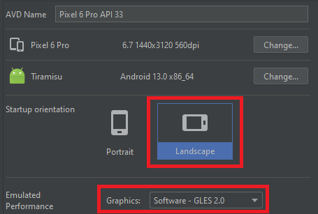
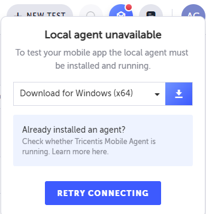
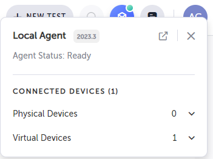
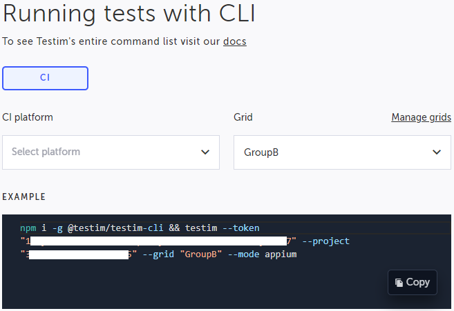
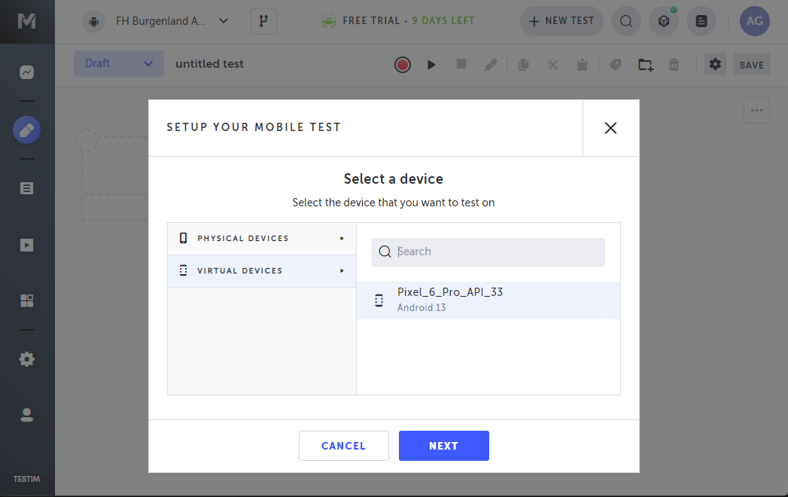
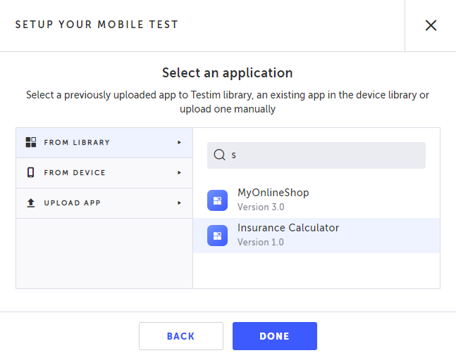
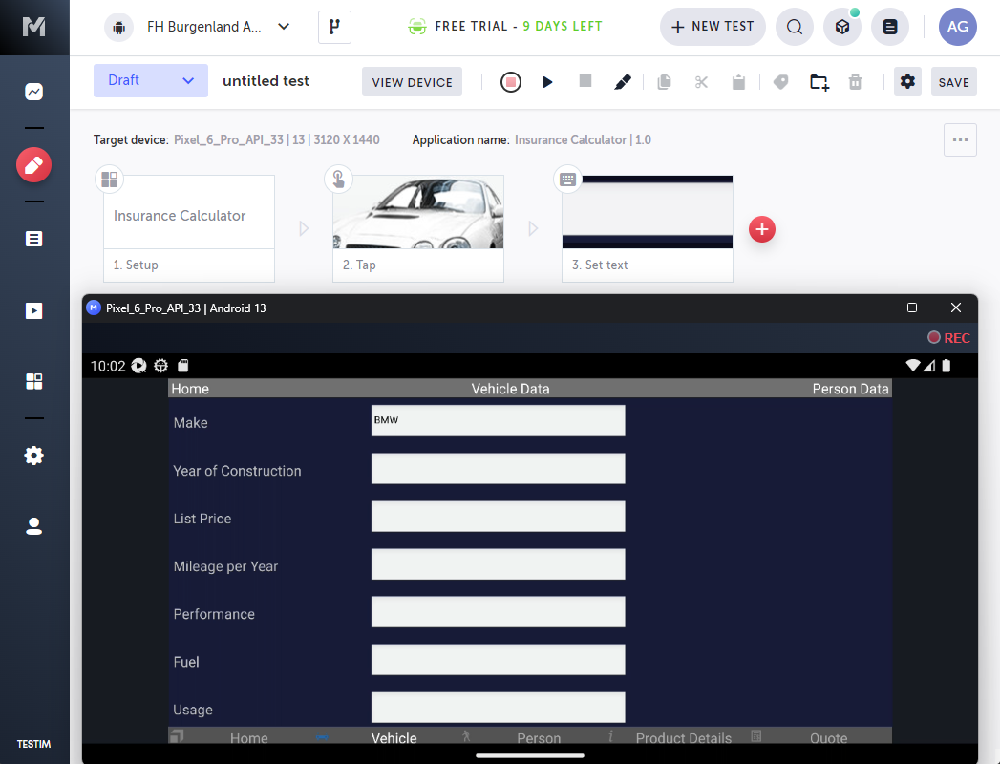
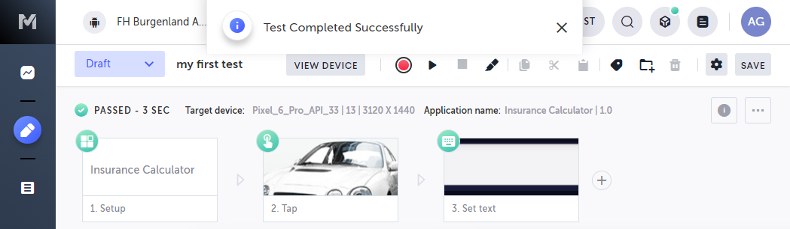

# ss2023-tmcsp-testim

Technical management of cloud solutions PT module testing

## Task

Automated testing of Tricentis Insurance Calculator App Android with Tricentis Testim and GitLab CI as CI/CD platform.

The test case created in the task is to be executed automatically in a pipeline on a HeadSpin device.
A manual trigger is sufficient.

Deliverables:
- A project documentation is to be handed in, which contains all the configuration steps that have been carried out
- The configuration itself should also be presented in a live demo on 22.06. be presented

The following screens are to be automated for a test case:
- Home screen
- Vehicle Data
- Person Data
- Product Details
- Quote

All dropdown menus in the app are to be automated in such a way that they mimic the user interactions of a real user.

The vehicle information in the Quote Page should be validated.
- Make, Year of construction, Performance, Fuel, Mileage Per Year, List price

## Setup

A lot of tools are involved in this whole project, some need to talk to each other.
This chapter is about configuration and enabling data exchange between the involved tools.

### Headspin

Login to [Headspin](https://www.headspin.io/) and go to the [user profile](https://ui.headspin.io/mysettings) page.

Make sure to get an API token and save it for later use.

Also make sure there are some Android devices available for you on the [devices](https://ui.headspin.io/remotecontrol/devices) page.

### Local Android emulator

Make sure to have Android Studio up and running, where you can easily configure Android simulators.

To avoid some issues with the App caused by unforeseeable issues with orientation changes, some configuration is required.

Configure a simulated device to have the following settings:
- Startup orientation: Landscape
- Graphics: Software - GLES 2.0

Example see here:



(Re)start the simulator afterwards.

### Tricentis Testim

Login to [Testim](https://app.testim.io/) and choose the Android project you want to work with.

#### Local agent

In the top right verify if a local agent is running.
When the agent is not running or was never installed it looks like this:



Follow the instructions and after the installation it should look like this:



Also notice the number of virtual devices listed in the screenshot above.
That is the running simulator which was configured [before](#local-android-emulator).

#### Adding the grid config

Go to the settings of the project, then choose 'CLI' and then 'Manage grids' and click the '+' to add a new grid.

Here choose 'Testim Headspin Mobile', then change the name if you want and set the token value to the token you got [before](#headspin).

Now go back to the 'CLI' overview and choose the new grid.
The example will show a functioning call of the CLI, which only misses a few parameters:



This is the base for running the CLI manually and automated.

## Create a test

First you need to create a test on a local device (Simulator device is recommended).

In [Testim](https://app.testim.io/) in your Android project, go to 'Mobile Apps' and make sure the App you want to test is listed there.
If that is not the case you can upload the .APK file there.

### Record the test

Go to 'Test list' and then select '+ New Test' in the top navigation.

Press the red 'Record' button, select the device you want to record the test with and select 'Next'.



Then choose the App you want to test from your App library and select 'Done'



The Tricentis Mobile Agent will open a window showing the device and loading the application to test.
Once the application the recording of the test can start.
Just use the App from withing the Mobile Client and every made interaction with the app is recorded.



Close the Mobile Client once the recording is done.
Save the test with the button on the top right and give the test a fitting name.

### Doing local verification

Local verification can be done by any device attached to Tricentis Mobile Agent.
Just open the test from the 'Test list' and press the 'Run test'/'Play' button.

An information at the top will show the result and at the top left the result is shown together with the time needed for the tests.
The test result is also indicated on each test step in the top left corner of the test step with a green or red icon.




### Add custom testdata

### Add input validation

## CLI

### The command

During configuration of the [grids](#adding-the-grid-config), the example call of testim CLI shows all required parameters.

```bash
npm i -g @testim/testim-cli && testim --token "<testim-token>" --project "<testim-project-id>" --grid "GroupB" --mode appium --label "GroupB" -c /tmp/testimConfig.js
```

To the command above, added parameters to the example are:
- `--label "GroupB"`: only tests with the label 'Group B' are executed
- `-c /tmp/testimConfig.js`: configuration file to adapt parts of the test configuration

Without Node installed one can also use the official `testim/docker-cli` Docker image to run the testim CLI:

```bash
docker run --rm -it -v c:\work\testimConfig.js:/tmp/testimConfig.js testim/docker-cli --token "<testim-token>" --project "<testim-project-id>" --grid "GroupB" --mode appium --label "GroupB" -c /tmp/testimConfig.js
```

### Verify testing on Headspin

## Automation

### GitHub
https://help.testim.io/docs/github-action-integration

### GitLab
https://help.testim.io/docs/gitlab-integration

## Sync GitHub to GitLab repository

Assuming you cloned the repository from GitHub, you will get the following output:
```bash
$ git remote -v
origin  https://github.com/mcce22extreme/ss2023-tmcsp-testim.git (fetch)
origin  https://github.com/mcce22extreme/ss2023-tmcsp-testim.git (push)
```

To sync the `main` branch to GitLab you need to add GitLab as second remote and push all changes to there.
```bash
# Add gitlab as remote
$ git remote add gitlab https://gitlab.com/mcce22extreme/ss2023-tmcsp-testim.git
# Verify result
$ git remote -v
origin  https://github.com/mcce22extreme/ss2023-tmcsp-testim.git (fetch)
origin  https://github.com/mcce22extreme/ss2023-tmcsp-testim.git (push)
gitlab        https://gitlab.com/mcce22extreme/ss2023-tmcsp-testim.git (fetch)
gitlab        https://gitlab.com/mcce22extreme/ss2023-tmcsp-testim.git (push)
# get latest changes from main
$ git checkout main
$ git pull
# ! Attention, careful !
# push latest changes to main on gitlab, assuming you have direct push rights
$ git push gitlab main
```
